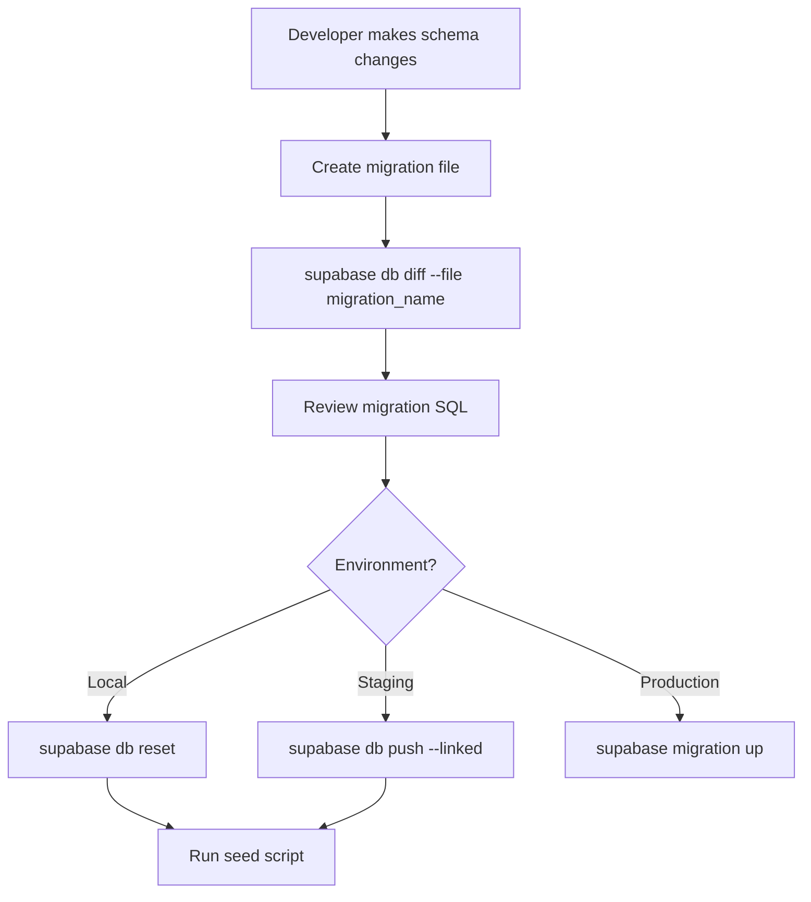

# Supabase Seed & Migration Plan

> [!NOTE]
> Tài liệu này mô tả kế hoạch triển khai tự động hóa migration và seed data cho Supabase, sử dụng cấu hình từ `.env`.

## Mục Tiêu

1. **Tự động hóa migration**: Chạy migrations từ command line thay vì thao tác thủ công
2. **Seed data automation**: Tự động tạo dữ liệu mẫu cho development/staging
3. **Environment-based config**: Đọc cấu hình từ `.env` để hỗ trợ multiple environments

---

## Hiện Trạng

### Cấu Trúc Hiện Tại

```
supabase/
├── config.toml           # Supabase CLI configuration
├── migrations/           # SQL migration files
│   ├── 20250130000001_add_performance_indexes.sql
│   └── 20250202000000_init_supabase.sql
├── functions/            # Edge Functions
└── templates/            # Email templates
```

### Environment Variables

| Variable                        | Mô tả                |
| ------------------------------- | -------------------- |
| `EXPO_PUBLIC_SUPABASE_URL`      | Supabase project URL |
| `EXPO_PUBLIC_SUPABASE_ANON_KEY` | Public anonymous key |

---

## Kế Hoạch Triển Khai

### Phase 1: Thiết Lập Seed Script

#### 1.1 Tạo `supabase/seed.sql`

```sql
-- Seed data chỉ chạy trong development
-- Kiểm tra environment trước khi seed

-- Sample Tasks for testing
INSERT INTO public.tasks (id, user_id, title, description, status, priority)
SELECT
  uuid_generate_v4(),
  (SELECT id FROM auth.users LIMIT 1),
  'Sample Task ' || i,
  'Description for task ' || i,
  CASE WHEN i % 4 = 0 THEN 'completed'
       WHEN i % 4 = 1 THEN 'in_progress'
       ELSE 'pending' END,
  CASE WHEN i % 3 = 0 THEN 'high'
       WHEN i % 3 = 1 THEN 'medium'
       ELSE 'low' END
FROM generate_series(1, 10) AS i
WHERE EXISTS (SELECT 1 FROM auth.users LIMIT 1)
ON CONFLICT DO NOTHING;
```

#### 1.2 Tạo TypeScript Seed Script

Tạo `supabase/scripts/seed.ts`:

```typescript
import { createClient } from '@supabase/supabase-js'
import dotenv from 'dotenv'
import path from 'path'

// Load environment variables
dotenv.config({ path: path.resolve(__dirname, '../../.env') })

const supabaseUrl = process.env.EXPO_PUBLIC_SUPABASE_URL
const supabaseServiceKey = process.env.SUPABASE_SERVICE_ROLE_KEY // Cần thêm

if (!supabaseUrl || !supabaseServiceKey) {
  console.error('Missing required environment variables')
  process.exit(1)
}

const supabase = createClient(supabaseUrl, supabaseServiceKey)

async function seedDatabase() {
  console.log('🌱 Starting database seeding...')

  // Add your seed logic here
  const { error } = await supabase.rpc('seed_development_data')

  if (error) {
    console.error('❌ Seeding failed:', error.message)
    process.exit(1)
  }

  console.log('✅ Database seeded successfully!')
}

seedDatabase()
```

---

### Phase 2: Cấu Hình CLI Scripts

#### 2.1 Thêm vào `package.json`

```json
{
  "scripts": {
    "supabase:start": "supabase start",
    "supabase:stop": "supabase stop",
    "supabase:migrate": "supabase db push",
    "supabase:migrate:local": "supabase migration up --local",
    "supabase:reset": "supabase db reset",
    "supabase:seed": "tsx supabase/scripts/seed.ts",
    "supabase:setup": "npm run supabase:migrate && npm run supabase:seed",
    "supabase:link": "supabase link --project-ref $SUPABASE_PROJECT_REF"
  }
}
```

#### 2.2 Thêm Environment Variables

Cập nhật `.env`:

```bash
# Existing
EXPO_PUBLIC_SUPABASE_URL=https://your-project.supabase.co
EXPO_PUBLIC_SUPABASE_ANON_KEY=your-anon-key

# New - Server-side only
SUPABASE_SERVICE_ROLE_KEY=your-service-role-key
SUPABASE_PROJECT_REF=your-project-ref
SUPABASE_DB_PASSWORD=your-db-password
```

---

### Phase 3: Migration Workflow



---

### Phase 4: Tích Hợp CI/CD

#### GitHub Actions Workflow

Tạo `.github/workflows/supabase-migrate.yml`:

```yaml
name: Supabase Migration

on:
  push:
    branches: [main]
    paths:
      - 'supabase/migrations/**'

jobs:
  migrate:
    runs-on: ubuntu-latest
    steps:
      - uses: actions/checkout@v4

      - uses: supabase/setup-cli@v1
        with:
          version: latest

      - name: Link Supabase Project
        run: |
          supabase link --project-ref ${{ secrets.SUPABASE_PROJECT_REF }}
        env:
          SUPABASE_ACCESS_TOKEN: ${{ secrets.SUPABASE_ACCESS_TOKEN }}

      - name: Run Migrations
        run: supabase db push
        env:
          SUPABASE_ACCESS_TOKEN: ${{ secrets.SUPABASE_ACCESS_TOKEN }}
```

---

## Cấu Trúc File Mới

```
supabase/
├── config.toml
├── seed.sql                    # [NEW] SQL seed data
├── migrations/
├── functions/
├── templates/
└── scripts/                    # [NEW]
    ├── seed.ts                 # TypeScript seed script
    ├── reset-dev.sh            # Development reset script
    └── migrate-prod.sh         # Production migration script
```

---

## Các Lệnh Thường Dùng

| Command                 | Mô tả                                 |
| ----------------------- | ------------------------------------- |
| `pnpm supabase:start`   | Khởi động Supabase local              |
| `pnpm supabase:migrate` | Push migrations lên remote            |
| `pnpm supabase:reset`   | Reset database và chạy lại migrations |
| `pnpm supabase:seed`    | Chạy seed data script                 |
| `pnpm supabase:setup`   | Setup hoàn chỉnh (migrate + seed)     |

---

## Checklist Triển Khai

- [ ] Thêm `SUPABASE_SERVICE_ROLE_KEY` vào `.env`
- [ ] Thêm `SUPABASE_PROJECT_REF` vào `.env`
- [ ] Tạo `supabase/seed.sql` với sample data
- [ ] Tạo `supabase/scripts/seed.ts`
- [ ] Cập nhật `package.json` scripts
- [ ] Tạo `.github/workflows/supabase-migrate.yml`
- [ ] Thêm secrets vào GitHub repository
- [ ] Test migration workflow locally
- [ ] Test CI/CD pipeline

---

## Lưu Ý Quan Trọng

> [!WARNING]
> **Không bao giờ commit `SUPABASE_SERVICE_ROLE_KEY`** vào version control. Key này có full access đến database.

> [!CAUTION]
> **Seed data chỉ nên chạy trên development/staging**, không chạy trên production để tránh ảnh hưởng dữ liệu thật.

> [!TIP]
> Sử dụng `supabase db diff` để tự động generate migration files từ schema changes.
